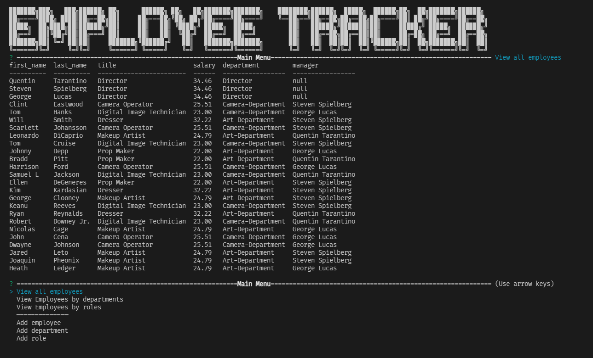

# Employee Tracker

Url to this repository: https://github.com/LifeInvaderr/Employee-Trackeer

## Description
With Employee Tracker, the user has the ability to create departments, titles within those departments, and the employees who hold that title.

## Table of Contents
* [Technologies](#technologies)
* [Installation](#installation)
* [Usage](#usage)
* [Questions](#questions)

## Technologies
* JavaScript
* Inquirer.js
* MySQL

## Installation
To install this repository, please either clone or install the zip version.

Once installed, you will need to run `npm install` to download the needed node modules.

After installation, run the mySQL shell within your command prompt, and source the following files

* db/db.sql
* db/schema.sql
* db/seeds.sql (optional as it will run pre-filled information)

## Usage
With Employee Tracker, to run the program after installation, run the command `npm start` to initiallize the program. After running the program, the user is given prompts to add a department, title, and employee

## Questions
For any questions or concerns, please email me at matthewkausfox@gmail.com 

Thank you!
